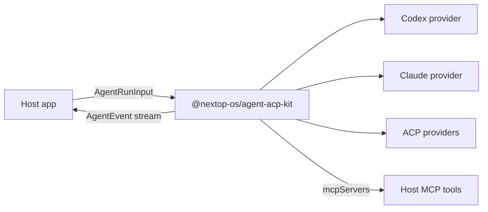

# @nextop-os/agent-acp-kit

<p align="center">
  <strong>A TypeScript toolkit for running local coding agents through one ACP-oriented host API.</strong>
</p>

<p align="center">
  <a href="https://www.npmjs.com/package/@nextop-os/agent-acp-kit"></a>
  <a href="https://www.npmjs.com/package/@nextop-os/agent-acp-kit"></a>
  <a href="https://github.com/nextop-os/agent-acp-kit/actions/workflows/npm-package-release.yml"></a>
  = 22">
  
  
</p>

`@nextop-os/agent-acp-kit` lets a host application detect, launch, stream, cancel, and resume local coding agents through a stable TypeScript facade.

It is built for apps that want to support Codex, Claude Code, and ACP-compatible agents without scattering provider-specific process, transport, MCP, skill, model, and event parsing logic throughout the app.

This is an embeddable host SDK. It is not a replacement for ACP clients such as [`acpx`](https://github.com/openclaw/acpx), and it is not a single-provider ACP adapter binary such as `codex-acp`.

## Why This Exists

Local coding agents do not all expose the same interface:

- Codex is CLI-first and can stream JSONL from `codex exec --json`.
- Claude Code is CLI-first and streams `stream-json` output.
- ACP-compatible agents speak JSON-RPC session protocols.
- Host apps still need their own messages, sessions, tool permissions, replay, canvas state, billing, and product semantics.

This package sits in the middle. It owns local agent execution. Your application owns product behavior.



## Ecosystem Fit

The ACP ecosystem has several layers. This package focuses on the host-app SDK layer.

| If you need... | Use... |
| --- | --- |
| A Codex-compatible ACP agent binary for editors or ACP clients | `codex-acp` or another provider-specific ACP adapter |
| A CLI/TUI client with persistent ACP sessions, queues, cancel, status, and config | [`acpx`](https://github.com/openclaw/acpx) |
| A registry of ACP-compatible agents and install metadata | The [ACP Registry](https://agentclientprotocol.com/get-started/registry) |
| An embeddable TypeScript runtime for your own desktop, web, or local host app | `@nextop-os/agent-acp-kit` |

In practical terms:

- ACP adapters expose one provider as an ACP agent process.
- ACP clients consume ACP agents and manage user-facing sessions.
- The ACP Registry helps clients discover installable agents.
- `@nextop-os/agent-acp-kit` helps application hosts call multiple local agents while keeping product concepts such as messages, tools, replay, billing, and canvas state outside the package.

## Install

```bash
npm install @nextop-os/agent-acp-kit
```

Other package managers work too:

```bash
pnpm add @nextop-os/agent-acp-kit
yarn add @nextop-os/agent-acp-kit
bun add @nextop-os/agent-acp-kit
```

Requirements:

- Node.js 22 or newer.
- ESM runtime.
- Installed provider CLIs for the providers you want to use.

## Quick Start

```ts
import {
  createClaudeProvider,
  createCodexProvider,
  createLocalAgentRuntime,
} from "@nextop-os/agent-acp-kit";

const runtime = createLocalAgentRuntime({
  providers: [
    createCodexProvider(),
    createClaudeProvider(),
  ],
});

const detections = await runtime.detect();
console.log(detections.map((item) => ({
  provider: item.provider,
  supported: item.result?.supported !== false,
  models: item.result?.models,
  reason: item.result?.unsupportedReason,
})));

for await (const event of runtime.run({
  runId: crypto.randomUUID(),
  provider: "codex",
  cwd: "/path/to/workspace",
  prompt: "Inspect this project and summarize the architecture.",
  model: "codex:gpt-5.4",
})) {
  if (event.type === "text_delta") {
    process.stdout.write(event.text);
  }

  if (event.type === "tool_call") {
    console.log("tool started", event.name, event.input);
  }

  if (event.type === "done") {
    console.log("run finished", event.status);
  }
}
```

## What You Get

| Area | Included |
| --- | --- |
| Runtime facade | `detect()`, `run()`, `cancel()`, `listProviders()` |
| Providers | Codex, Claude Code, Hermes, Kimi, Kiro, generic ACP, fake test provider |
| Process runtime | command resolution, stdin prompt delivery, timeout, cancel, stderr tail, redaction |
| Transports | JSONL, plain stdout, ACP JSON-RPC |
| MCP delivery | normalized stdio/http MCP server config passed into provider launch plans |
| Skills | materialized files, prompt injection, project-instruction style delivery, cleanup |
| Events | normalized `AgentEvent` discriminated union |
| Testing | fake provider, fake ACP peer, fixtures, conformance helpers |

## Provider Support

| Provider | Status | Transport | Notes |
| --- | --- | --- | --- |
| Codex | Supported | `codex exec --json` JSONL | Dynamic model discovery via `codex debug models` when available |
| Claude Code | Supported | `claude -p --output-format stream-json` | Uses fallback model hints and allows custom model pass-through |
| Hermes | Experimental | ACP JSON-RPC | Shared generic ACP transport |
| Kimi | Experimental | ACP JSON-RPC | Shared generic ACP transport |
| Kiro | Experimental | ACP JSON-RPC | Shared generic ACP transport |
| Generic ACP | Experimental | ACP JSON-RPC | Bring your own ACP agent command |
| Fake | Test helper | In-memory async events | For host tests and conformance checks |

## Host Integration Pattern

Treat this package as the local-agent execution layer, not as your application orchestrator.

Your host should own:

- User, session, run, and message persistence.
- Assistant message anchor creation.
- Runtime policy, such as trusted local mode, default provider, default model, and tool allowlists.
- Domain tools and MCP server creation.
- Mapping `AgentEvent` into your app stream, websocket, or replay protocol.
- Billing, job queues, media storage, canvas writes, and product state.
- Cross-provider resume or handoff semantics.

This package should own:

- Provider detection and capability reporting.
- Provider-specific command args, env, MCP config delivery, and model normalization.
- Process supervision and transport handling.
- Provider output parsing into `AgentEvent`.
- Cleanup of per-run temporary files it creates.

Keep the host adapter thin:

```ts
const mcpServers = [{
  name: "app-tools",
  type: "stdio" as const,
  command: process.execPath,
  args: ["/absolute/path/to/app-tools-mcp.js"],
  env: {
    APP_TOOL_TOKEN: runScopedToken,
    APP_DAEMON_URL: "http://127.0.0.1:3001",
  },
}];

for await (const event of runtime.run({
  runId,
  provider: selectedProvider,
  cwd: workspaceDir,
  prompt: userPrompt,
  systemPrompt,
  history,
  model,
  mcpServers,
  skillManifest,
  extraAllowedDirs: [workspaceDir],
  env: providerEnv,
  resume: resumeContext,
})) {
  await projectAgentEventToHostStream(event);
}
```

## Events

`AgentEvent` is a TypeScript discriminated union. Narrow on `event.type` and TypeScript will expose the fields for that event variant.

```ts
if (event.type === "tool_result" && event.status === "failed") {
  console.error(event.error);
}
```

Common event types:

| Event | Meaning |
| --- | --- |
| `status` | Lifecycle progress such as detecting, spawning, running, warning |
| `thinking_delta` | Incremental reasoning or thinking text when a provider exposes it |
| `text_delta` | Assistant text |
| `tool_call` | Normalized tool start |
| `tool_result` | Normalized tool completion or failure |
| `stderr` | Redacted stderr text |
| `error` | Runtime or provider error |
| `done` | Terminal event with `completed`, `failed`, or `canceled` |

Hosts should persist enough event data for replay and should treat `done` as the terminal source of truth for a run.

## Models

Use `runtime.detect()` to get provider installation status, support status, and model hints.

```ts
const modelOptions = await runtime.detect();
```

Provider behavior differs:

- Codex: attempts dynamic discovery with `codex debug models`, then falls back to bundled or package model hints.
- Claude Code: returns fallback hints such as `sonnet`, `opus`, `haiku`, and known full ids. Custom model ids can be passed through.
- ACP providers: attempt model discovery through ACP session lifecycle when the peer supports it.

Hosts should not hardcode Codex or Claude model lists above this package. If a UI needs custom models, keep that UI behavior in the host and pass the chosen id into `AgentRunInput.model`.

## MCP Tools

This package does not define product tools. It accepts `mcpServers` and converts them into the provider's expected format.

```ts
const mcpServers = [{
  name: "app-tools",
  type: "stdio" as const,
  command: "node",
  args: ["/absolute/path/to/app-tools-mcp.js"],
  env: { APP_TOOL_TOKEN: runScopedToken },
}];
```

Keep tool tokens run-scoped and short-lived. Do not pass broad application secrets or database credentials directly to agent processes.

## Skills

`skillManifest` supports three delivery modes:

- `materialized-files`: writes skill files into the run workspace and references them in the prompt.
- `prompt-injection`: injects skill content into the provider prompt.
- `project-instructions`: injects instruction-style skill content.

The package handles delivery and cleanup. The host remains the source of truth for skill selection, permission, and storage.

## Cancellation And Resume

Use `runtime.cancel(runId)` or abort the `signal` passed into `runtime.run()`.

```ts
const controller = new AbortController();
const stream = runtime.run({ ...input, signal: controller.signal });

controller.abort();
await runtime.cancel(input.runId);
```

Resume is conservative by design:

- Same-provider resume may pass `providerSessionId` or `resumeToken` when the provider supports it.
- If no provider resume metadata exists, pass `resume: { mode: "fresh" }`.
- Cross-provider resume should be host-level handoff: rebuild prompt, history, and context, then start a fresh provider run.

## Public API

Main export:

```ts
import {
  createLocalAgentRuntime,
  createCodexProvider,
  createClaudeProvider,
  createGenericAcpProvider,
  createHermesProvider,
  createKimiProvider,
  createKiroProvider,
  type AgentEvent,
  type AgentRunInput,
} from "@nextop-os/agent-acp-kit";
```

Runtime control plane export:

```ts
import {
  createRuntimeControlPlane,
  inferRuntimeKind,
} from "@nextop-os/agent-acp-kit/runtime-control-plane";
```

Testing export:

```ts
import {
  assertProviderConformance,
  createFakeAcpPeer,
  createFakeProvider,
} from "@nextop-os/agent-acp-kit/testing";
```

## Development

```bash
pnpm install
pnpm typecheck
pnpm test
pnpm build
pnpm pack:check
```

Provider-specific changes should cover:

- Detection success and fallback.
- Launch plan args, env, model, MCP, and prompt input.
- Parser output for text, tools, errors, and terminal events.
- Cancellation and nonzero exit stderr.
- ACP initialize, session, model, prompt, and cancel lifecycle when applicable.

## Release

Normal releases use the GitHub Actions workflow `.github/workflows/npm-package-release.yml`.

Release inputs:

| Input | Use |
| --- | --- |
| `version_bump=patch` | Routine compatible fixes |
| `version_bump=minor` | Backward-compatible features |
| `version_bump=major` | Breaking public API changes |
| `version_bump=custom` | Prereleases or explicit versions, with `custom_version` |
| `dist_tag` | npm dist-tag, usually `latest` or `next` |
| `dry_run` | Validate without publishing, committing, or tagging |

The workflow computes the next version from `package.json`, runs install, typecheck, tests, build, `npm pack --dry-run`, publishes with npm provenance, then commits the version bump and pushes tag `v<version>`.

## Security

Local agents execute user-trusted CLIs on the local machine. Only enable this package in trusted local mode.

Recommended host policy:

- Use run-scoped tool tokens with TTL and explicit revoke.
- Do not pass Supabase, database, or cloud provider tokens directly to agents.
- Redact stdout and stderr before persistence.
- Clean per-run temporary directories.
- Limit MCP tool allowlists per run.
- Gate dangerous provider flags behind trusted local mode.
- Persist terminal events durably so cancellation or failure cannot be overwritten by late process output.

## Roadmap

- Stabilize the public `AgentRunInput` and `AgentEvent` contracts.
- Expand provider conformance tests for ACP lifecycle edge cases.
- Add more provider-specific adapters where shared ACP behavior is not enough.
- Add first-class examples for desktop apps and local web apps.
- Add repository-level `LICENSE`, `CONTRIBUTING.md`, and `SECURITY.md` before broader external contribution.
