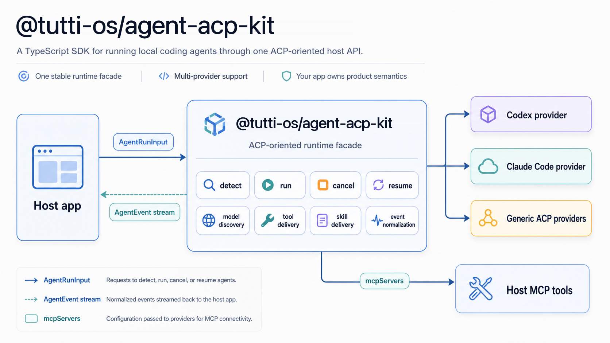

# @tutti-os/agent-acp-kit

<p align="center">
  <strong>A TypeScript toolkit for running local coding agents through one ACP-oriented host API.</strong>
</p>

<p align="center">
  <a href="./LICENSE"></a>
  <a href="https://www.npmjs.com/package/@tutti-os/agent-acp-kit"></a>
  <a href="https://github.com/tutti-os/agent-acp-kit/actions/workflows/npm-package-release.yml"></a>
  = 22">
  
  
</p>

<p align="center">
  
</p>

`@tutti-os/agent-acp-kit` lets a host application detect, launch, stream, cancel, and resume local coding agents through a stable TypeScript facade.

It is built for apps that want to support Codex, Claude Code, and ACP-compatible agents such as Gemini CLI, Cursor Agent, GitHub Copilot CLI, Factory Droid, fast-agent, OpenCode, Qwen Code, Kimi CLI, Kilo, Mistral Vibe, and Trae CLI without scattering provider-specific process, transport, MCP, skill, model, and event parsing logic throughout the app.

This is an embeddable host SDK. It is not a replacement for ACP clients such as [`acpx`](https://github.com/openclaw/acpx), and it is not a single-provider ACP adapter binary such as `codex-acp`.

## Why This Exists

Local coding agents do not all expose the same interface:

- Codex is CLI-first and can stream JSONL from `codex exec --json`.
- Claude Code is CLI-first and streams `stream-json` output.
- ACP-compatible agents speak JSON-RPC session protocols and can be discovered through the ACP Registry.
- Host apps still need their own messages, sessions, tool permissions, replay, canvas state, billing, and product semantics.

This package sits in the middle. It owns local agent execution. Your application owns product behavior.

## ACP-compatible Agents

ACP-compatible agents in the wider ecosystem include:

| Agent              | Typical ACP command                |
| ------------------ | ---------------------------------- |
| Gemini CLI         | `gemini --acp`                     |
| Cursor Agent       | `cursor-agent acp`                 |
| GitHub Copilot CLI | `copilot --acp --stdio`            |
| Factory Droid      | `droid exec --output-format acp`   |
| fast-agent         | `uvx fast-agent-mcp acp`           |
| OpenCode           | `opencode acp`                     |
| Qwen Code          | `qwen --acp --experimental-skills` |
| Kimi CLI           | `kimi acp`                         |
| Kilo               | `kilo acp`                         |
| Mistral Vibe       | `vibe-acp`                         |
| Trae CLI           | `traecli acp serve`                |

This table is for ecosystem orientation. Commands can vary by agent version, so use the registry as the source of truth. Built-in provider support in this package is listed below, and hosts can use `createGenericAcpProvider()` or a custom provider plugin when they already have an ACP command to launch.

For the latest installable agent list, see:

- [ACP Registry guide](https://agentclientprotocol.com/get-started/registry)
- [agentclientprotocol/registry](https://github.com/agentclientprotocol/registry)
- [latest registry JSON](https://cdn.agentclientprotocol.com/registry/v1/latest/registry.json)

## Install

```bash
npm install @tutti-os/agent-acp-kit
```

Other package managers work too:

```bash
pnpm add @tutti-os/agent-acp-kit
yarn add @tutti-os/agent-acp-kit
bun add @tutti-os/agent-acp-kit
```

Requirements:

- Node.js 22 or newer.
- ESM runtime.
- Installed provider CLIs for the providers you want to use.

## Local Quick Start

For a regular local host, the application owns the workspace directory and
passes that path directly as `cwd`.

```ts
import {
  createClaudeProvider,
  createCodexProvider,
  createLocalAgentRuntime,
} from "@tutti-os/agent-acp-kit";

const runtime = createLocalAgentRuntime({
  providers: [createCodexProvider(), createClaudeProvider()],
});

const detections = await runtime.detect();
console.log(
  detections.map((item) => ({
    provider: item.provider,
    supported: item.supported,
    authState: item.authState,
    models: item.models,
    reason: item.reason,
  })),
);

for await (const event of runtime.run({
  runId: crypto.randomUUID(),
  provider: "codex",
  cwd: "/path/to/workspace",
  prompt: "Inspect this project and summarize the architecture.",
  model: "codex:gpt-5.4",
})) {
  if (event.type === "text_delta") {
    process.stdout.write(event.text);
  }

  if (event.type === "tool_call") {
    console.log("tool started", event.name, event.input);
  }

  if (event.type === "done") {
    console.log("run finished", event.status);
  }
}
```

## What You Get

| Area              | Included                                                                                                                |
| ----------------- | ----------------------------------------------------------------------------------------------------------------------- |
| Runtime facade    | `detect()`, `run()`, `cancel()`, `listProviders()`                                                                      |
| Providers         | Codex, Claude Code, ACP presets, generic ACP, fake test provider                                                        |
| Process runtime   | command resolution, stdin prompt delivery, timeout, cancel, stderr tail, redaction                                      |
| Transports        | JSONL, plain stdout, ACP JSON-RPC                                                                                       |
| MCP delivery      | normalized stdio/http MCP server config passed into provider launch plans                                               |
| Skills            | materialized files, prompt injection, project-instruction style delivery, cleanup                                       |
| Events            | normalized `AgentEvent` discriminated union                                                                             |
| Testing           | fake provider, fake ACP peer, fixtures, conformance helpers                                                             |
| Tutti integration | auto CLI-backed/standalone agent catalog, target-scoped composer options, dynamic skill context, browser-safe contracts |

## Tutti Workspace Apps

Tutti apps keep platform integration behind `@tutti-os/agent-acp-kit/tutti` and keep actual Agent execution in an app-owned local runtime:

```ts
import {
  createDefaultLocalAgentRuntime,
} from "@tutti-os/agent-acp-kit";
import {
  loadTuttiAgentCatalog,
  loadTuttiAgentComposerOptions,
  loadTuttiAgentSkillContext,
} from "@tutti-os/agent-acp-kit/tutti";

const runtime = createDefaultLocalAgentRuntime();
const cwd = process.env.TUTTI_WORKSPACE_ROOT ?? process.cwd();
const env = { ...process.env };
const detectContext = { cwd, env };
const catalog = await loadTuttiAgentCatalog({ runtime, detectContext });
const agent =
  catalog.agents.find(
    (item) =>
      item.agentTargetId === catalog.defaultAgentTargetId &&
      item.runtimeSupported &&
      item.availability.status === "available",
  ) ??
  catalog.agents.find(
    (item) => item.runtimeSupported && item.availability.status === "available",
  );
if (!agent) {
  throw new Error("No local Agent is currently available.");
}
const composer = await loadTuttiAgentComposerOptions({
  runtime,
  agentTargetId: agent.agentTargetId,
  detectContext,
});
const skills = await loadTuttiAgentSkillContext({
  agentTargetId: agent.agentTargetId,
  agentSessionId: runId,
  cwd: appLocalCwd,
  detectContext,
});
for await (const event of runtime.run({
  runId,
  provider: agent.providerId,
  cwd,
  env,
  prompt,
  skillManifest: skills.skillManifest,
})) {
  // Persist or stream normalized Agent events in the App.
}
```

There is no app-facing mode switch. `loadTuttiAgentCatalog()` is the selection
API: it preserves every exact Agent Target even when several agents share one
runtime provider. When a Tutti CLI is configured, the catalog uses `agent list`
plus target-scoped composer and skill JSON. Otherwise it derives stable
`local:<provider-id>` target IDs from Provider plugin detection. Provider IDs
remain runtime metadata and are passed to
`runtime.run()` only after the host has selected an exact `agentTargetId`.

The integration negotiates both daemon generations during rollout. It prefers
the agent-ID contract and falls back to the old provider contract only when the
CLI reports that `agent list` is unsupported. The kit resolves provider runtime
metadata internally from the selected target. Legacy fallback requires an exact
target ID from the old catalog and fails closed when multiple targets share a
provider; ordinary CLI failures never trigger fallback.

Apps that wrap a Provider plugin can preserve that customization:

```ts
const runtime = createDefaultLocalAgentRuntime({
  providers: customProviderPlugins,
});
```

Hosts can pass the same `detectContext` object to runtime detection and skill
helpers. App-owned Tutti children use `projectTuttiCliChildProcess` at their
child boundary and pass returned output through
`redactTuttiCliChildProcessText` before logging or returning errors.

Apps do not construct daemon URLs or CLI argv, read catalog tokens, pass app IDs,
or derive agent IDs from provider names. They persist and round-trip the exact
`agentTargetId` returned by the live catalog. Provider IDs are open runtime
metadata rather than the public selection identity. Claude Code runtime metadata
is canonicalized to `claude-code`; legacy `claude` remains input-only.

Frontend code can import DTO types and guards without Node dependencies:

```ts
import {
  isTuttiAgentCatalog,
  type TuttiAgentCatalog,
} from "@tutti-os/agent-acp-kit/tutti/contracts";
```

## Provider Support

| Provider                    | Status       | Transport                               | Notes                                                                                                                                                                                                                                                   |
| --------------------------- | ------------ | --------------------------------------- | ------------------------------------------------------------------------------------------------------------------------------------------------------------------------------------------------------------------------------------------------------- |
| Codex                       | Supported    | `codex exec --json` JSONL               | Dynamic model discovery via `codex debug models`; per-run `CODEX_HOME` with copied auth and sanitized config; same-provider resume via `codex exec resume --json <session> -`                                                                           |
| Claude Code (`claude-code`) | Supported    | `claude -p --output-format stream-json` | Canonical provider ID is `claude-code`; legacy `claude` input is accepted internally; supports fallback model hints, custom model pass-through, and same-provider resume via `--resume <session>`                                                       |
| Tutti Agent (`tutti-agent`) | Supported    | `tutti-agent exec --json` JSONL         | First-party canonical provider; runs use a temporary `TUTTI_AGENT_HOME` derived from the VM-local source Home; authentication is probed with `tutti-agent login status`; no Nexight runtime alias |
| Devin for Terminal          | Experimental | ACP JSON-RPC                            | Shared generic ACP transport; command override `DEVIN_ACP_BIN`                                                                                                                                                                                          |
| Hermes                      | Experimental | ACP JSON-RPC                            | Shared generic ACP transport; command override `HERMES_ACP_BIN`                                                                                                                                                                                         |
| Kimi                        | Experimental | ACP JSON-RPC                            | Shared generic ACP transport; command override `KIMI_ACP_BIN`                                                                                                                                                                                           |
| Kiro                        | Experimental | ACP JSON-RPC                            | Shared generic ACP transport; command override `KIRO_ACP_BIN`                                                                                                                                                                                           |
| Kilo                        | Experimental | ACP JSON-RPC                            | Shared generic ACP transport; command override `KILO_ACP_BIN`                                                                                                                                                                                           |
| Mistral Vibe                | Experimental | ACP JSON-RPC                            | Shared generic ACP transport; command override `VIBE_ACP_BIN`                                                                                                                                                                                           |
| Cursor Agent                | Experimental | ACP JSON-RPC                            | Shared generic ACP transport; command override `CURSOR_ACP_BIN`                                                                                                                                                                                         |
| Gemini CLI                  | Experimental | ACP JSON-RPC                            | Shared generic ACP transport; command override `GEMINI_ACP_BIN`                                                                                                                                                                                         |
| OpenCode                    | Experimental | ACP JSON-RPC                            | Shared generic ACP transport; command override `OPENCODE_ACP_BIN`                                                                                                                                                                                       |
| Qoder CLI                   | Experimental | ACP JSON-RPC                            | Shared generic ACP transport; command override `QODER_ACP_BIN`                                                                                                                                                                                          |
| Qwen Code                   | Experimental | ACP JSON-RPC                            | Shared generic ACP transport; command override `QWEN_ACP_BIN`                                                                                                                                                                                           |
| Generic ACP                 | Experimental | ACP JSON-RPC                            | Bring your own ACP agent command                                                                                                                                                                                                                        |
| Fake                        | Test helper  | In-memory async events                  | For host tests and conformance checks                                                                                                                                                                                                                   |

Built-in real local providers do not impose a provider-level concurrency cap. Hosts can still enforce stricter queueing, cancellation, or watchdog policies around `runtime.run()` when a product surface needs serialized execution.

Local Codex runs always use a run-scoped temporary `CODEX_HOME`. The temporary
root comes from run env `TMPDIR`, `TEMP`, or `TMP`, then process env, then the
OS default. The provider shares `auth.json`, `sessions/`, and `plugins/cache/`
with the requested `CODEX_HOME` or the user's default `~/.codex` so token
refreshes, native resume, and plugin assets stay durable across runs; plugin
cache exposure is best-effort and does not block a run. It copies isolated
config files such as `config.json`, `config.toml`, and `instructions.md`,
preserves compatible `config.toml` settings such as custom model providers and
`base_url`, removes Codex config values known to break current CLI parsing,
disables Codex native multi-agent for single-process run lifecycle safety, and
overlays any run-scoped MCP server config.

## Host Integration Pattern

Treat this package as the local-agent execution layer, not as your application orchestrator.

Your host should own:

- User, session, run, and message persistence.
- Assistant message anchor creation.
- Runtime policy, such as trusted local mode, default provider, default model, and tool allowlists.
- Domain tools and MCP server creation.
- Mapping `AgentEvent` into your app stream, websocket, or replay protocol.
- Billing, job queues, media storage, canvas writes, and product state.
- Cross-provider resume or handoff semantics.

This package should own:

- Provider detection and capability reporting.
- Provider-specific command args, env, MCP config delivery, and model normalization.
- Process supervision and transport handling.
- Provider output parsing into `AgentEvent`.
- Cleanup of per-run temporary files it creates.

Keep the host adapter thin:

```ts
const mcpServers = [
  {
    name: "app-tools",
    type: "stdio" as const,
    command: process.execPath,
    args: ["/absolute/path/to/app-tools-mcp.js"],
    env: {
      APP_TOOL_TOKEN: runScopedToken,
      APP_DAEMON_URL: "http://127.0.0.1:3001",
    },
  },
];

for await (const event of runtime.run({
  runId,
  provider: selectedProvider,
  cwd: workspaceDir,
  prompt: userPrompt,
  systemPrompt,
  history,
  model,
  mcpServers,
  skillManifest,
  extraAllowedDirs: [workspaceDir],
  env: providerEnv,
  resume: resumeContext,
})) {
  await projectAgentEventToHostStream(event);
}
```

## Events

`AgentEvent` is a TypeScript discriminated union. Narrow on `event.type` and TypeScript will expose the fields for that event variant.

```ts
if (event.type === "tool_result" && event.status === "failed") {
  console.error(event.error);
}
```

Common event types:

| Event            | Meaning                                                           |
| ---------------- | ----------------------------------------------------------------- |
| `status`         | Lifecycle progress such as detecting, spawning, running, warning  |
| `thinking_delta` | Incremental reasoning or thinking text when a provider exposes it |
| `text_delta`     | Assistant text                                                    |
| `tool_call`      | Normalized tool start                                             |
| `tool_result`    | Normalized tool completion or failure                             |
| `stderr`         | Redacted stderr text                                              |
| `error`          | Runtime or provider error                                         |
| `done`           | Terminal event with `completed`, `failed`, or `canceled`          |

For MCP tool events, `name` is the normalized short tool name. Providers that
surface a server namespace may also include `rawName` and `mcpServerName`, so
hosts can distinguish same-named tools exposed by different MCP servers while
keeping backward-compatible short-name routing.

Hosts should persist enough event data for replay and should treat `done` as the terminal source of truth for a run. Individual `error` events are diagnostics, not terminal status by themselves.

Codex reconnect progress such as `Reconnecting... 2/5 (request timed out)` is a transient provider retry state. The Codex provider maps those JSONL messages to `status` events with `status: "warning"` so hosts can show progress without ending the run.

## Models

Use `runtime.detect()` to get provider installation status, support status, and model hints.

```ts
const modelOptions = await runtime.detect();
```

No-argument detection is cached for the lifetime of the runtime. After a host
installs a provider or otherwise changes the local CLI environment, call
`runtime.detect({ refresh: true })` to clear that cache and probe the current
machine state.

Provider behavior differs:

- Codex: attempts dynamic discovery with `codex debug models`, then falls back to bundled or package model hints.
- Claude Code: returns fallback hints such as `sonnet`, `opus`, `haiku`, and known full ids, then adds configured custom ids from the Claude settings file when present. Custom model ids can be passed through.
- ACP providers: attempt model discovery through ACP session lifecycle when the peer supports it.

Provider plugin diagnostics remain internal to standalone projection. The
public result intentionally contains only provider identity, `supported`,
`authState`, models/default model, and an optional display-only `reason`.

Hosts should not hardcode Codex or Claude model lists above this package. If a UI needs additional custom models, keep that UI behavior in the host and pass the chosen id into `AgentRunInput.model`.

## Permissions

Runs accept an optional provider-neutral permission selection. Pass both the
semantic returned by the composer and its provider mode id when available:

```ts
permission: {
  modeId: selectedMode.id,
  semantic: selectedMode.semantic,
}
```

The SDK maps this policy to each provider. Workspace App runs default to
`full-access` when the host omits `permission`: Codex uses its unrestricted
sandbox mode, Claude uses `bypassPermissions`, and ACP requests select a
recognized permissive option when the peer offers one (otherwise the request
is cancelled).
An App can pass an explicit narrower semantic for a run. For ACP, every
non-`full-access` semantic cancels permission requests because the protocol
adapter cannot safely infer a tool's risk from a provider-specific option id.

## VM-local Codex Home

For Codex runs, pass the VM session user's existing Codex home explicitly:

```ts
for await (const event of runtime.run({
  runId,
  provider: "codex",
  cwd: workspaceDir,
  prompt,
  env: {
    ...process.env,
    CODEX_HOME: "/home/tsh-runtime/.codex",
  },
  mcpServers,
})) {
  // Project AgentEvent into the host protocol.
}
```

The value in `CODEX_HOME` is the source home owned by the VM session user. The
kit creates a temporary per-run Codex home under `TMPDIR`, links `auth.json` and
shared session/plugin state from the source home, copies and sanitizes
`config.toml`, and overlays the run's MCP servers. It never treats an App
runtime directory as the source login home.

## Installing Local Providers

Hosts can expose an install action for supported local providers through one
public function:

```ts
import { installAgentProvider } from "@tutti-os/agent-acp-kit";

const result = await installAgentProvider("codex");
```

Supported install targets are `codex` and `claude`. The function installs and
checks the official provider CLIs only:

- Codex install: `npm install -g @openai/codex`
- Claude Code install: `npm install -g @anthropic-ai/claude-code`

ACP adapter packages such as `codex-acp` and `claude-agent-acp` are not required
for these built-in providers. The install status still reports whether legacy
adapter binaries are present as compatibility metadata, but adapter presence no
longer affects `availability`, command selection, or post-install success.

The result is structured instead of throwing raw shell output. Failed installs
include a `failureReason` such as `install_command_failed`,
`install_timed_out`, or `post_install_probe_failed`. A successful install can
still return `auth_required` in `after.availability`; hosts should then prompt
the user to log in with the provider CLI.

Install, detection, and runtime launch envs include common local binary
directories such as `/opt/homebrew/bin`, `/usr/local/bin`, `~/.local/bin`, npm
configured prefix bins, and npm's global prefix bin when it can be resolved.

## MCP Tools

This package does not define product tools. It accepts `mcpServers` and converts them into the provider's expected format.

```ts
const mcpServers = [
  {
    name: "app-tools",
    type: "stdio" as const,
    command: "node",
    args: ["/absolute/path/to/app-tools-mcp.js"],
    env: { APP_TOOL_TOKEN: runScopedToken },
    toolTimeoutMs: 30 * 60_000,
    startupTimeoutMs: 2 * 60_000,
  },
];
```

Timeouts are normalized by provider. Codex writes `startup_timeout_sec` and
`tool_timeout_sec` into its per-run config. Claude Code writes per-server
`timeout` for tool calls. Generic ACP providers receive only standard ACP MCP
server fields because the ACP MCP server schema does not define timeout fields.
Codex and Claude MCP delivery uses those provider-native, run-scoped config
paths. Generic ACP providers receive normalized MCP servers through ACP.

Keep tool tokens run-scoped and short-lived. Do not pass broad application secrets or database credentials directly to agent processes.

## Skills

`skillManifest` supports three delivery modes:

- `materialized-files`: writes skill files into the run workspace and references them in the prompt.
- `prompt-injection`: injects skill content into the provider prompt.
- `project-instructions`: injects instruction-style skill content.

The package handles delivery and cleanup. The host remains the source of truth for skill selection, permission, and storage.

Hosts can also pass skill manifests produced by external commands. Tutti
workspace apps can use the Tutti subpath helper to load dynamic CLI skills, then
decide how to merge Tutti's recommended system prompt with the app-owned prompt:

```ts
import { loadTuttiAgentSkillContext } from "@tutti-os/agent-acp-kit/tutti";

const tuttiContext = await loadTuttiAgentSkillContext({
  provider,
  agentSessionId: runId,
  cwd,
  commandEnvNames: ["MY_APP_TUTTI_CLI"],
});
const systemPrompt = [
  appSystemPrompt,
  tuttiContext.recommendedSystemPrompt?.content,
]
  .filter(Boolean)
  .join("\n\n");

for await (const event of runtime.run({
  runId,
  provider,
  cwd,
  prompt,
  systemPrompt,
  skillManifest: tuttiContext.skillManifest,
})) {
  await projectAgentEventToHostStream(event);
}
```

## Cancellation And Resume

Use `runtime.cancel(runId)` or abort the `signal` passed into `runtime.run()`.

```ts
const controller = new AbortController();
const stream = runtime.run({ ...input, signal: controller.signal });

controller.abort();
await runtime.cancel(input.runId);
```

Resume is conservative by design:

- Same-provider resume may pass `providerSessionId` or `resumeToken` when the provider supports it.
- If no provider resume metadata exists, pass `resume: { mode: "fresh" }`.
- Cross-provider resume should be host-level handoff: rebuild prompt, history, and context, then start a fresh provider run.

Hosts should still pass durable `history` on every run. Native resume is an optimization for the same provider, not the only source of continuity:

```ts
const sameProvider = previousRun?.provider === selectedProvider;
const providerResumeId =
  previousRun?.providerSessionId ?? previousRun?.resumeToken;
const resume =
  sameProvider && providerResumeId
    ? {
        mode: "provider" as const,
        providerSessionId: previousRun?.providerSessionId,
        resumeToken: previousRun?.resumeToken,
      }
    : { mode: "fresh" as const };

for await (const event of runtime.run({
  runId,
  provider: selectedProvider,
  cwd,
  prompt,
  history: durableMessages,
  resume,
})) {
  if (event.type === "done") {
    await saveRunResumeMetadata(runId, {
      providerSessionId: event.sessionId,
      resumeToken: event.resumeToken,
    });
  }
}
```

## Public API

Main export:

```ts
import {
  createLocalAgentRuntime,
  createCodexProvider,
  createClaudeProvider,
  createDefaultLocalAgentProviderPlugins,
  createGenericAcpProvider,
  installAgentProvider,
  type AgentEvent,
  type AgentRunInput,
} from "@tutti-os/agent-acp-kit";
```

Runtime control plane export:

```ts
import {
  createRuntimeControlPlane,
  inferRuntimeKind,
} from "@tutti-os/agent-acp-kit/runtime-control-plane";
```

Testing export:

```ts
import {
  assertProviderConformance,
  createFakeAcpPeer,
  createFakeProvider,
} from "@tutti-os/agent-acp-kit/testing";
```

## Development

```bash
pnpm install
pnpm typecheck
pnpm test
pnpm build
pnpm pack:check
```

## Release Workflow

Use `.github/workflows/npm-package-release.yml` for package releases.

Stable `latest` releases:

- Open and merge a PR that bumps `package.json` to the target stable version.
- Run the workflow from `main` with `version_bump=current`, `dist_tag=latest`, and `dry_run=true` first.
- Re-run with `dry_run=false` to publish the current `package.json` version and push tag `v<version>`.

Beta and other prerelease packages:

- Run the workflow from a feature or release branch.
- Use `dist_tag=beta` and either a prerelease bump such as `prepatch`, `preminor`, `premajor`, or `prerelease`, or `version_bump=custom` with a prerelease version such as `0.3.0-beta.0`.
- The workflow commits the prerelease version bump back to the triggering branch, publishes the package, and pushes tag `v<version>`.

The workflow never commits directly to `main`. Non-`latest` releases must use prerelease semver versions, and `latest` releases must use stable semver versions.

## Security

Local agents execute user-trusted CLIs on the local machine. Only enable this package in trusted local mode.

Recommended host policy:

- Use run-scoped tool tokens with TTL and explicit revoke.
- Do not pass Supabase, database, or cloud provider tokens directly to agents.
- Redact stdout and stderr before persistence.
- Clean per-run temporary directories.
- Limit MCP tool allowlists per run.
- Gate dangerous provider flags behind trusted local mode.
- Persist terminal events durably so cancellation or failure cannot be overwritten by late process output.

## License

@tutti-os/agent-acp-kit is licensed under the [Apache License 2.0](./LICENSE).

## Roadmap

- Stabilize the public `AgentRunInput` and `AgentEvent` contracts.
- Expand provider conformance tests for ACP lifecycle edge cases.
- Add more provider-specific adapters where shared ACP behavior is not enough.
- Add first-class examples for desktop apps and local web apps.
- Add repository-level `CONTRIBUTING.md` and `SECURITY.md` before broader external contribution.
